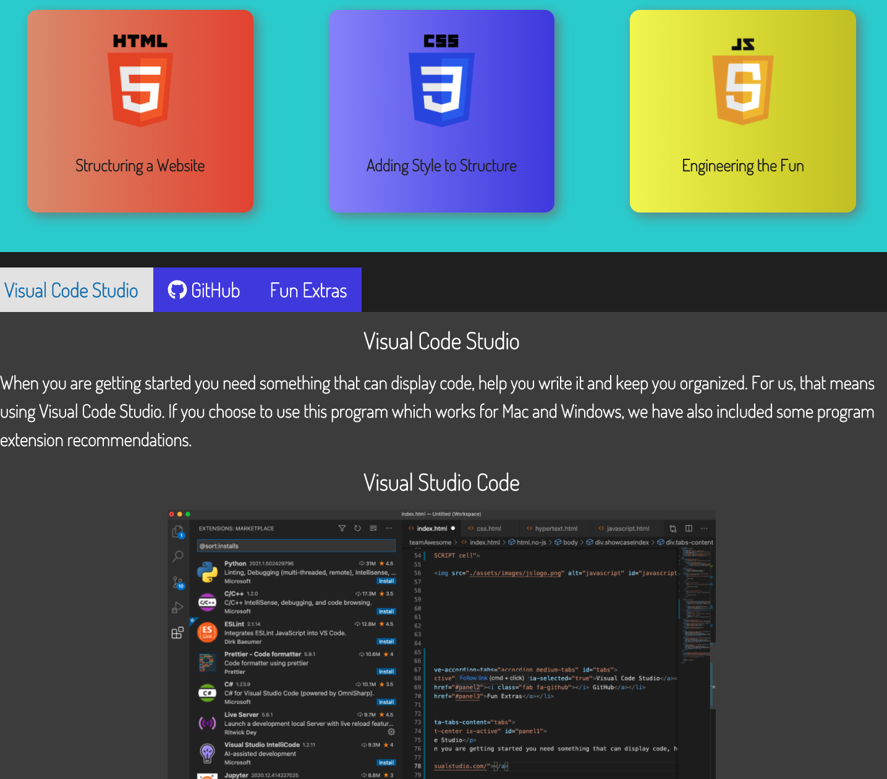

# Web Developer Redemption

## Building as a TEAM

This is the first group project that our bootcamp cohort worked on together. It was an assignment to create and application in teams of four or so. 

It was a great experience and we learned so much together! 

Our team members on this Project were:

[Indervir Singh](https://github.com/indervirsingh)

[Larry Jenkins](https://github.com/larrygjenkins)

[Matthew Webb](https://github.com/MWebb2321)

[Kiel Sprague](https://github.com/Aereisdin)

## Facing Challenges and Moving Forward

There are many issues that can come up on a group project. You can find yourself at a loss as to what to create, how to impliment what you wish to make and/or who is in charge of what. Very early on our team dynamic start off smoothly, a team committee working toward consensus.

The work was divided fairly equaly and evenly based on time and interest areas.

This being the first time all of us had worked in a group one of the major challenges we faced had to do with overcoming merge conflicts in GitHub. Luckily these types of issues were rare but happened just enough to give us a solid idea on how to deal with them.

## What is Web Dev Redemption?

Web Dev Redemption is an application created to help those brand new developers out there in the world who are just getting started. 

1. Resouces
2. Everyday Jargon
3. Working Examples

These are the main ideas that encapsulate what we were striving to create while working within the time criteria given. 

## What is the Vision of the Future?

In an ideal setting we would continue to build out with more resources, working examples and explinations to help the Newbie get going in the right direction with the most current and up-to-date resources needed to have a solid foundation using real world lingo as they adjust to the jargon of the industry.

### Screenshot of the Application

# Thank you so very much!
We are deeply grateful for the opportunities to present our work here and to each other for the work done in providing the vision and implimentation of this application.

Feel free to reach out with any questions, comments or concerns that you may have.

## Link to Application

http://aereisdin.github.io/teamAwesome